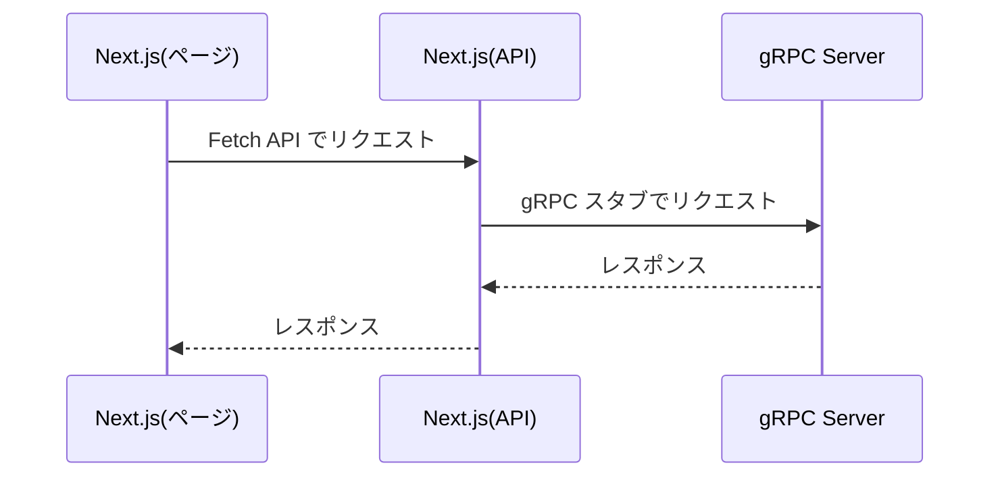

Next.js(App Router) で gRPC Client を実装します。  

今回作成したコードは以下のリポジトリにあります。
https://github.com/sayuprc-learning/nextjs-grpc

## 前提

- gRPC サーバーがある
- App Router を利用した Next.js プロジェクト
- proto ファイルから事前にコードを生成する[^1]
- 通信方式は Unary PRC のみ

## gRPC クライアントの実装

はじめに、gRPC クライアントの実装に必要なパッケージを導入します。

```sh
$ npm i @grpc/grpc-js 

$ npm i -D grpc_tools_node_protoc_ts grpc-tools
```

各パッケージについての詳細は以下をご参照ください。

https://github.com/grpc/grpc-node

次に proto ファイルからコードを生成するスクリプトを登録します。

```json:package.json
{
  "scripts": {
    "gen": "grpc_tools_node_protoc --js_out=import_style=commonjs,binary:./app/_generated --grpc_out=grpc_js:./app/_generated --plugin=protoc-gen-grpc=./node_modules/.bin/grpc_tools_node_protoc_plugin --ts_out=grpc_js:./app/_generated -I ./proto ./proto/greet.proto"
  },
}
```

コードの生成先(`--js_out`,`--grpc_out`,`--ts_out`)と対象の proto ファイルへのパスは適宜変更してください。  
スクリプトの追加ができたらコマンドを実行します。

```sh
$ npm run gen
```

`./app/_generated` 配下にコードが生成されます。

```
app/
 └─ _generated
    ├── greet_grpc_pb.d.ts
    ├── greet_grpc_pb.js    // Service の実装
    ├── greet_pb.d.ts
    └── greet_pb.js         // message の実装
```

次に gRPC クライアントを実装していきます。  
ここでは Next.js の [Route Handlers](https://nextjs.org/docs/app/building-your-application/routing/route-handlers) を利用します。

以下のようなイメージで実装していきます。


### API

```ts:app/api/route.ts
import { NextRequest, NextResponse } from 'next/server'
import { GreetServiceClient } from '../_generated/greet_grpc_pb'
import { GreetRequest, GreetResponse } from '../_generated/greet_pb'
import * as grpc from '@grpc/grpc-js'

const client = new GreetServiceClient('localhost:50051', grpc.ChannelCredentials.createInsecure())

export interface Params {
  name?: string
}

export interface GreetJsonResponse {
  message: string
}

export const GET = async (request: NextRequest): Promise<NextResponse<GreetJsonResponse>> => {
  const params = getParams(request)

  const grpcRequest = new GreetRequest()
  grpcRequest.setName(params?.name ?? '')

  const grpcResponse = await new Promise<GreetResponse>((resolve, reject) => {
    client.greet(grpcRequest, (serviceError: grpc.ServiceError | null, response: GreetResponse) => {
      if (serviceError) {
        reject(serviceError)
      }

      resolve(response)
    })
  })

  return NextResponse.json<GreetJsonResponse>({ message: grpcResponse.getMessage() })
}

const getParams = (request: NextRequest): Params => {
  const searchParams = request.nextUrl.searchParams

  return {
    name: searchParams.get('name') ?? undefined
  }
}
```

### ページ

```tsx:app/page.tsx
import { GreetJsonResponse } from './api/route'

export default async function Home() {
  // gRPC サーバーに通信する API を呼び出す
  const response = await fetch('http://localhost:3000/api')

  const json: GreetJsonResponse = await response.json()

  return (
    <div>
      {json.message}
    </div>
  )
}
```

## さいごに

Next.js で gRPC クライアントの実装ができました。  
App Router と Page Router ではちょっとしたところで勝手が違うので注意が必要ですが、基本的にはどちらも同じ考え方で実装します。

[^1]: `@grpc/proto-loader` を利用することで動的に proto ファイルを読み込むこともできます
